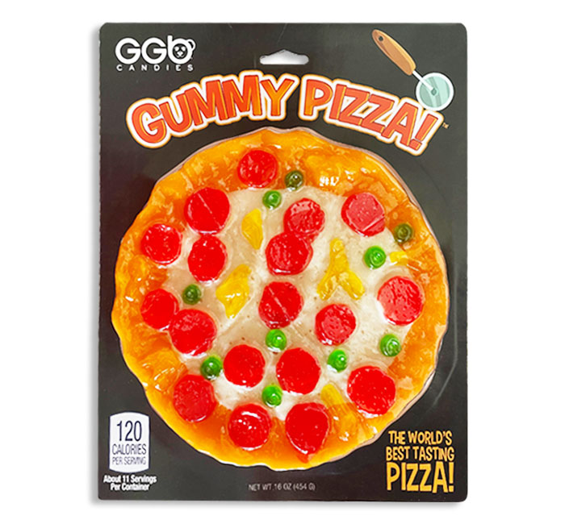
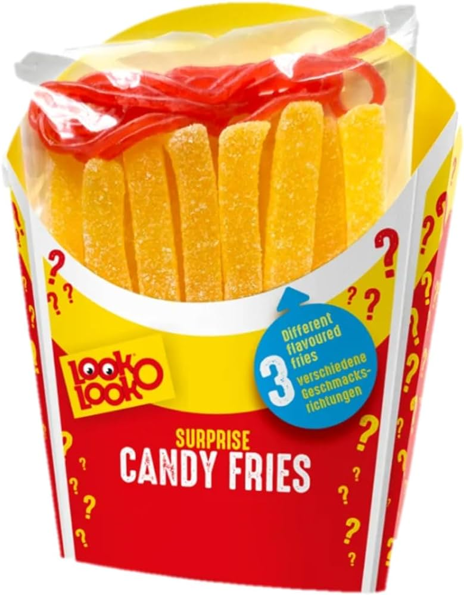
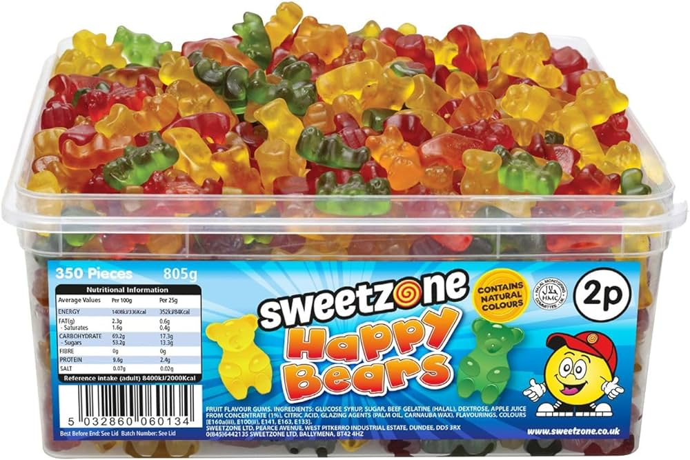
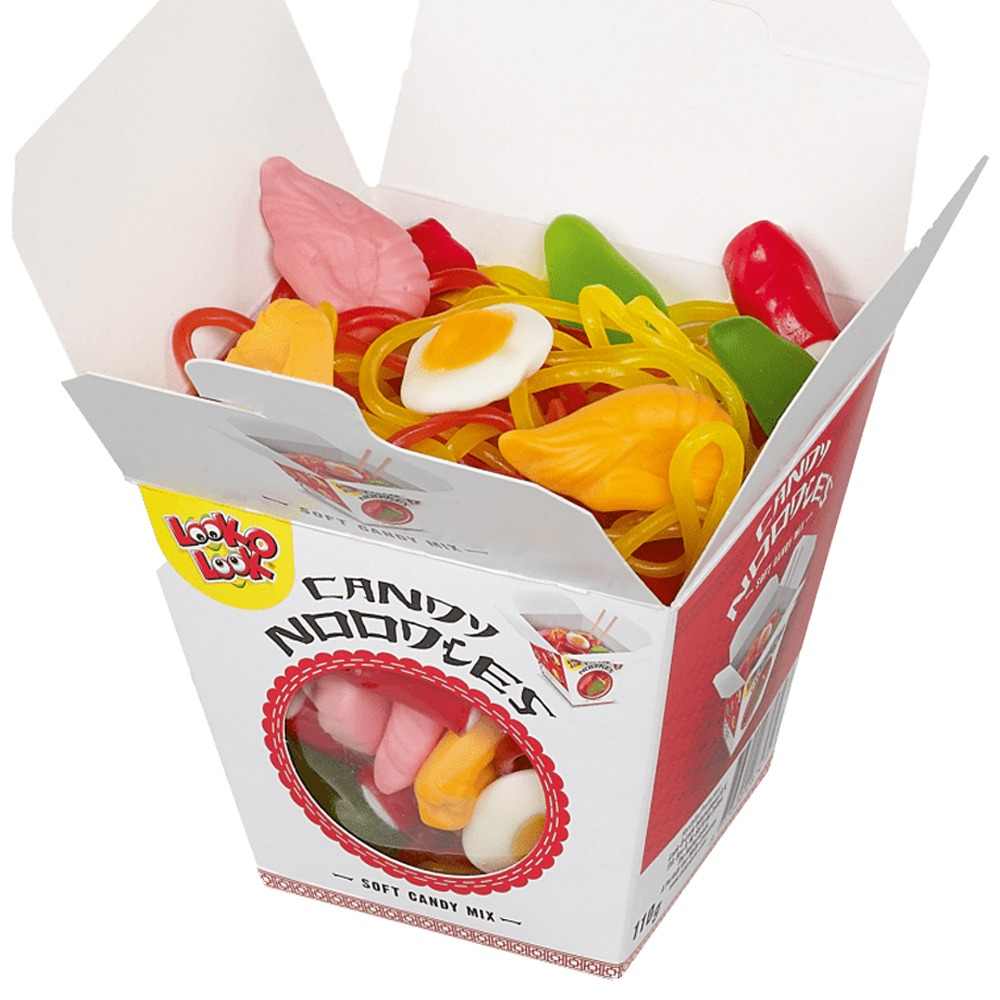
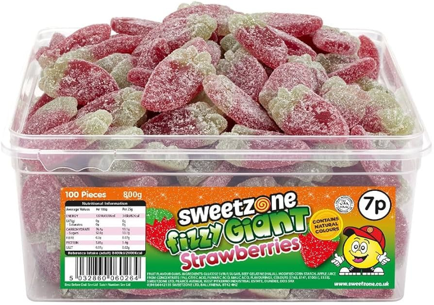
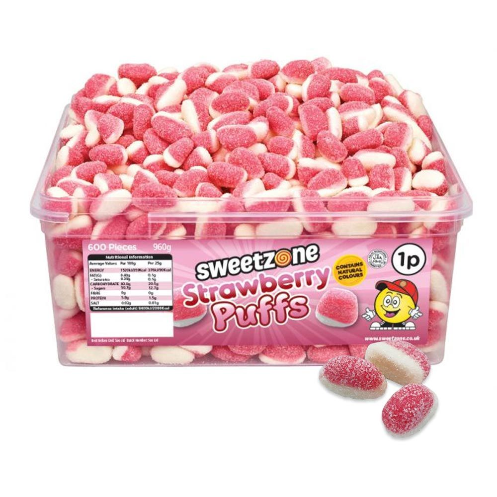
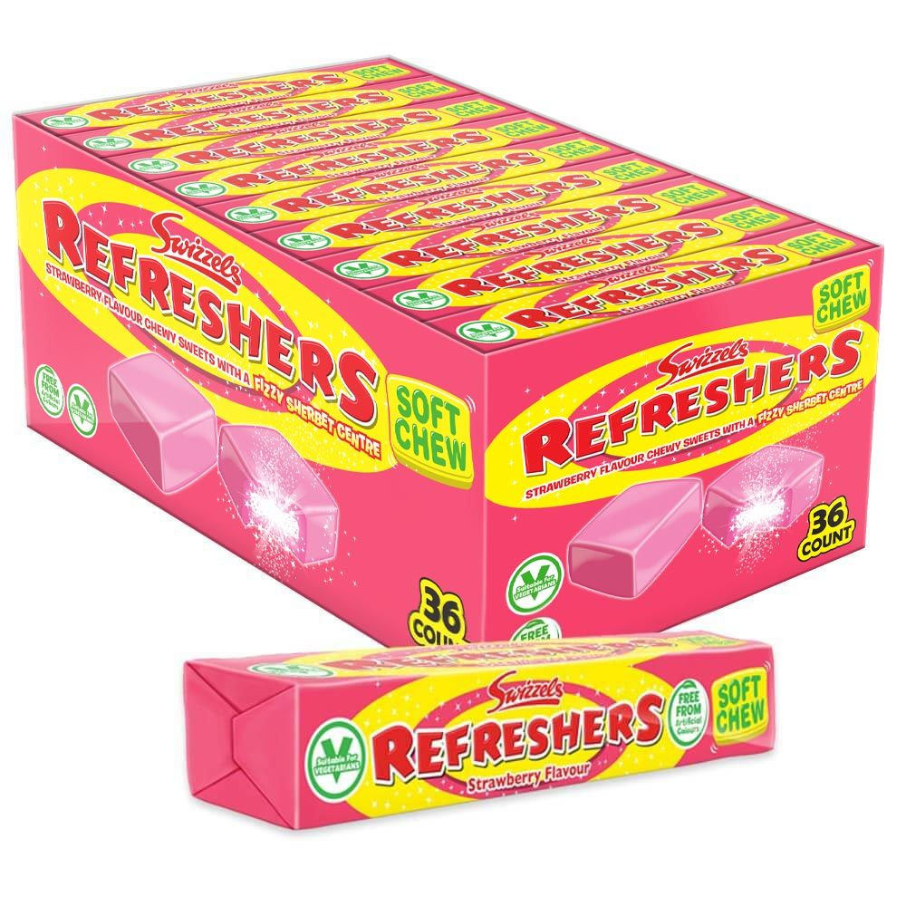
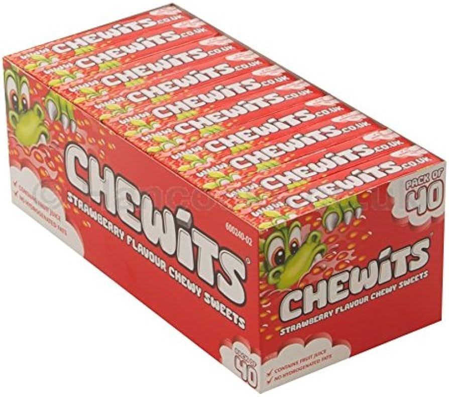
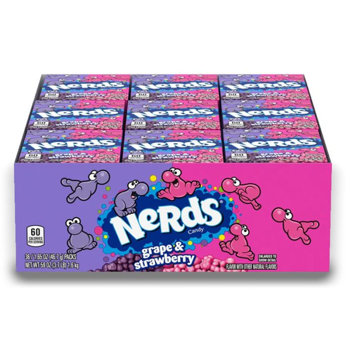
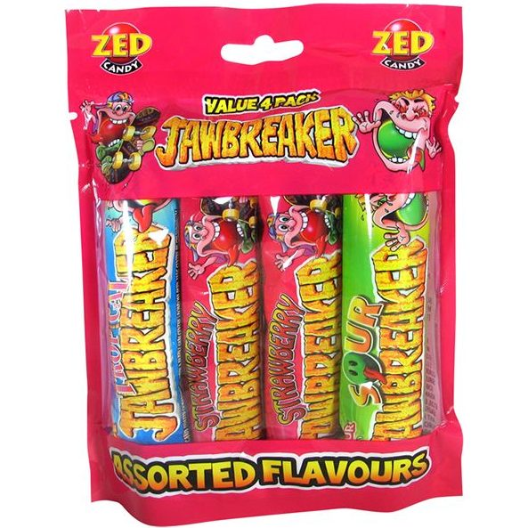

```{r setup, include=FALSE}
knitr::opts_chunk$set(echo = FALSE)
```

{width=35%}


{width=30%}

{width=35%}


{width=35%}

{width=35%}


{width=35%}


{width=35%}


{width=35%}


{width=35%}


{width=35%}

freeze dried candy


